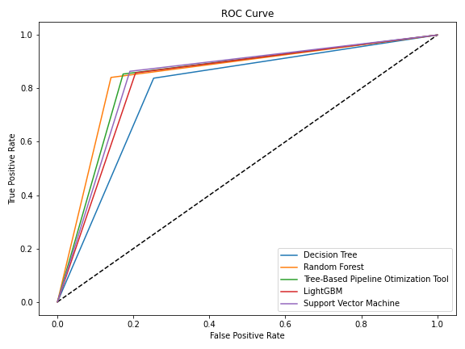

# Job-Change-of-Data-Scientist

## Project Overview
This project contains data and information from employee candidates at Big Data and Data Science companies.
The project aims to determine whether the employee candidate after training will continue to work with the company or not.
Performing comprehensive EDA on Job Change of Data Scientist dataset to understand important variables, handled missing values,
detect outliers, scaling, balancing the proportion of data and apply machine learning models to predict candidates decision to work with the company. The 
best model to this project is random forest using accuracy and ROC/AUC evaluation matrix as references of a success model.
After getting the best model, I created a simple web app that showed prediction results based on input set.

  
## Data Overview
The data retrieved from Kaggle dataset. The data consist of 19158 rows x 14 cols

| Variables                 | Description                                             |
|-------------------------- |---------------------------------------------------------|
| Enrollment ID             | Unique Enrollment ID number                             |
| City                      | City Code                                               |
| City Development Index    | City Development Index                                  |
| Gender                    | Gender of Candidates                                    |
| Relevent Experience       | Relevent Experience                                     |
| Enrolled University       | Type of Enrolled University                             |
| Education Level           | Education Level                                         |
| Major Dicipline           | Major Dicipline                                         |
| Experience                | Work Experience (year)                                  |
| Company Size              | Company Size                                            |
| Company Type              | Company Type                                            |
| Last New Job              | Time Difference between last job and current job        |
| Training Hours            | Length of Hours for Candidates to Complete the Training |
| Target                    | Candidate's Decision                                    |

## Framework Steps
1. Data Preparation
2. Data Cleaning
3. EDA
4. Feature Engineering & Feature Scaling
5. Modeling
6. Evaluation
7. Model Deployment

## Result
Using 5 models, this are the results of the evaluation of the matrix:

| Model               | Recall | Accuracy | ROC/AUC |
|---------------------|--------|----------|---------|
| Light GBM           | 0.86   | 0.83     | 0.83    |
| Random Forest       | 0.84   | 0.85     | 0.85    |
| Decision Tree       | 0.84   | 0.79     | 0.79    |
| SVM                 | 0.86   | 0.84     | 0.84    |
| TPOT                | 0.85   | 0.84     | 0.84    |

Please visit my tableau public profile here to see the visualization:

